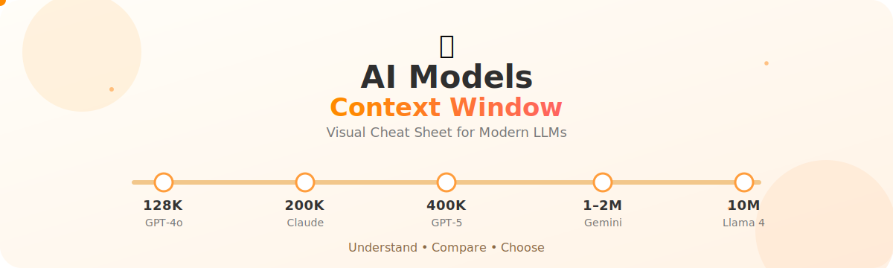

    

---

## Why This Repository?

One of the first questions people ask is:

> **"How much context can this model actually remember?"**

Instead of searching documentation for every provider, this repository puts everything into one clean reference.

---

## What is a Context Window?

A **context window** is the maximum number of tokens an AI model can process in a single conversation or request.

Think of it as the model's working memory.

A larger context window allows the model to:

- Understand longer conversations
- Analyze larger documents
- Read entire codebases
- Compare multiple files
- Keep more instructions in memory

---

# Context Window Comparison

| Model | Maximum Context Window |
|:------|-----------------------:|
| GPT-5 | **400K** |
| GPT-4.1 | **1M** |
| GPT-4o | **128K** |
| GPT-4 Turbo | **128K** |
| o3 | **200K** |
| o4-mini | **200K** |
| Claude 4 Opus | **200K** |
| Claude 4 Sonnet | **200K** |
| Claude 3.7 Sonnet | **200K** |
| Claude 3.5 Sonnet | **200K** |
| Claude 3 Opus | **200K** |
| Claude 3 Haiku | **200K** |
| Gemini 2.5 Pro | **1M** |
| Gemini 2.5 Flash | **1M** |
| Gemini 2.0 Flash | **1M** |
| Gemini 1.5 Pro | **2M** |
| Gemini 1.5 Flash | **1M** |
| DeepSeek R1 | **128K** |
| DeepSeek V3 | **128K** |
| Llama 4 Scout | **10M** |
| Llama 4 Maverick | **1M** |
| Llama 3.3 70B | **128K** |
| Llama 3.1 | **128K** |
| Mistral Large 2 | **128K** |
| Mixtral 8x22B | **64K** |
| Qwen 3 | **128K** |
| Qwen 2.5 | **128K** |
| Grok 4 | **256K** |

---

## Quick Comparison

| Range | Models |
|-------|--------|
| 64K | Mixtral |
| 128K | GPT-4o, DeepSeek, Llama 3, Qwen |
| 200K | Claude Family, o3, o4-mini |
| 256K | Grok 4 |
| 400K | GPT-5 |
| 1M | GPT-4.1, Gemini 2.5, Llama 4 Maverick |
| 2M | Gemini 1.5 Pro |
| 10M | Llama 4 Scout |

---

# Which One Should You Choose?

| Use Case | Recommended Context |
|-----------|--------------------|
| Chatbots | 128K |
| Coding | 200K+ |
| Long PDFs | 1M |
| Large Codebases | 1M+ |
| Books | 2M |
| Massive repositories | 10M |

---

## Keep in Mind

Context window **does not** measure intelligence.

A larger context window simply means the model can consider more information at once.

Model quality still depends on reasoning ability, training data, architecture, and inference quality.

---

## Contributing

Found an outdated value?

Open a Pull Request.

Model providers update context limits frequently, and community contributions help keep this reference accurate.

---

## Star the Repository ⭐

If this helped you, consider giving the repository a star.

It helps more developers discover it.

---

Made with ❤️ for the AI community.
